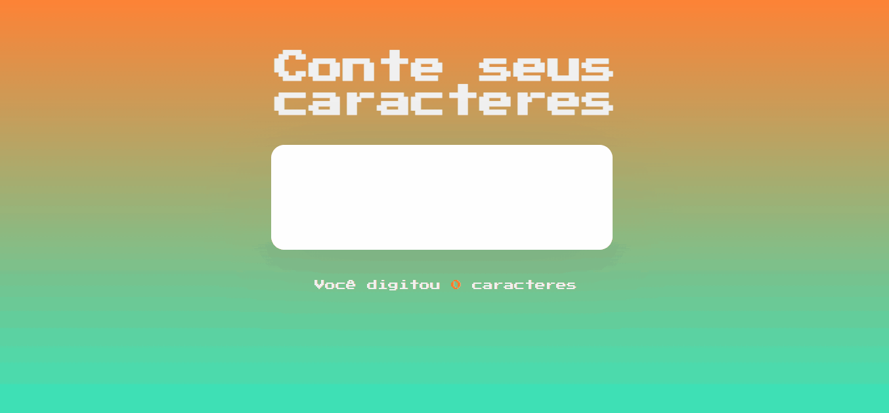

<h1 align="center"> Contador de Caracteres </h1>

Projeto desenvolvido com o objetivo de ajudar o usuário ao informar o número de caracteres que foram digitados no campo, oferecendo uma interface simples e amigável.  

  <a href="#-tecnologias">Tecnologias</a>&nbsp;&nbsp;&nbsp;|&nbsp;&nbsp;&nbsp;
  <a href="#-deploy">Deploy</a>&nbsp;&nbsp;&nbsp;|&nbsp;&nbsp;&nbsp;
  <a href="#-english-version">English Version</a>&nbsp;&nbsp;&nbsp;&nbsp;&nbsp;&nbsp;

  

## 🚀 Tecnologias

Esse projeto foi desenvolvido com as seguintes tecnologias:

- HTML e CSS
- JavaScript
- Git e Github
- Figma

## 💻 Deploy

> [Clique aqui para navegar para o projeto!](https://ssschneider.github.io/contador-de-caracteres/)

## 🌎 English Version

Character Counter is a project with the goal of informing user on the amount of character typed or pasted into the field with a simple and friendly interface. To do that, I've used:
- HTML, CSS, JS, Git, Github and Figma

> You can check out the deploy by [clicking here](https://ssschneider.github.io/contador-de-caracteres/) 

---
### Desenvolvido por Sarah Schneider 🖖
